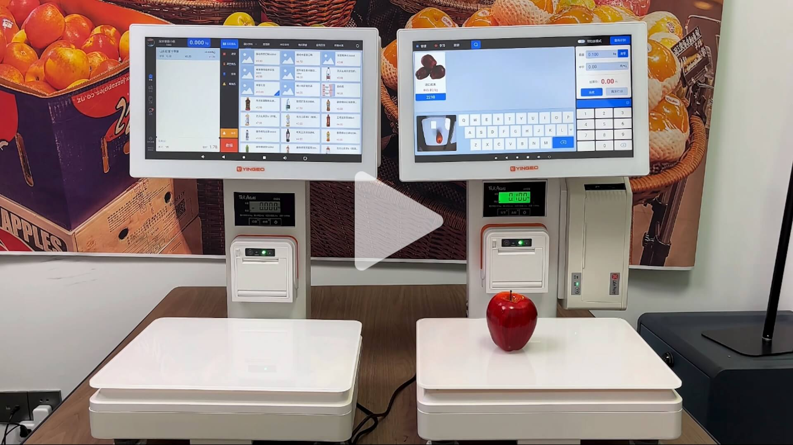

	

	<strong>银歌AI智能识别系统 -计算机视觉与人工智能技术，深度学习AI算法，赋能产业全新的智能化变革</strong>

	👉 <a href="https://www.yingeo.com">https://www.yingeo.com</a> 👈

-------------------------------------------------------------------------------

# 银歌AI智能识别系统

### 项目介绍

随着人们工作、生活智能化的不断推进，作为智能化承载者----摄像头，充当起了非常重要的“眼”的作用，智慧零售正成为一种趋势。银歌根据自身的收银系统、ERP软件、AI视觉识别技术、移动支付等领域上的优势，专门针对智慧零售研发出了货品识别、AI视觉结算、AI生鲜称重、客户身份识别、商品消费管控以及便捷支付等智能解决方案。

###  特性优势

- 支持离线识别，离线训练，离线学习，多端多平台高性能深度学习推理引擎
- 支持高通、MTK、RK等ARM CPU、Jetson、X86 CPU、NVIDIA GPU等，降低了90%以上的产品落地成本。
- 支持多平台：涵盖 Android、iOS、嵌入式 Linux 设备、Windows、macOS 和 Linux 主机
- 多场景，生鲜果蔬识别、五谷杂粮非标品识别、商品零食识别、车辆识别、动植物识别等

### 视觉结算流程

通过摄像头自动识别消费者放置在结算区的商品，代替传统人工扫码的方式，快速结算，改善购物体验。

### 部分功能截图

商品识别 ( 通过银歌AI识别系统能够提高收银效率，识别速度快到毫秒级别，无需熟记商品条码，能看就会用，更好地节约人力成本、提高运营效率的同时，为顾客提供更加流畅、高效、友好的自助称重体验。)

商品搜索

商品列表（银歌AI识别系统基本涵盖99.9%的生鲜水果蔬菜）

### 点击下面的演示视频

### AI前端硬件识别摄像头模组

### 集成方案

硬件客户: 深圳市银歌云技术提供标准的算法，模型，以及完整的边缘端部署方案。

软件客户: 提供标准的SDK，API接口，Flutter跨平台等方案。

零码接入银歌AI智能识别系统，助力产业界软硬件能力提升，推动和赋能智能化变革。

## 解决方案

生鲜果蔬(AI识别称重)：[点击这里](./docs/ai-weighing.md)

### 产品团队

产品经理：王成云，刘勤，万华勇

算法及模型训练：王成云，王炜锋

服务端架构：郭辉

边端计算及架构：王炜锋，王成云

***
微信扫描下方二维码，关注官方公众号：银歌收银，获取更多精彩内容。

