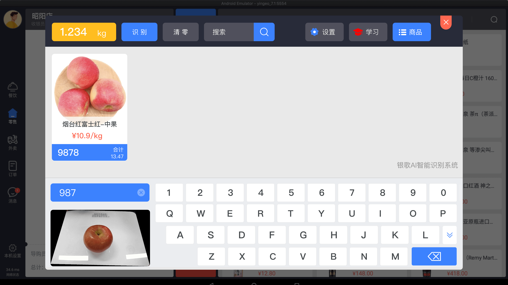
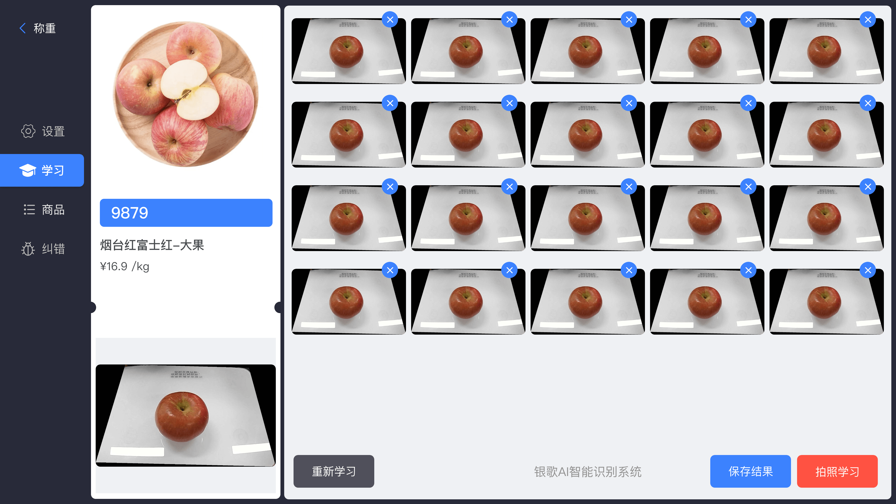
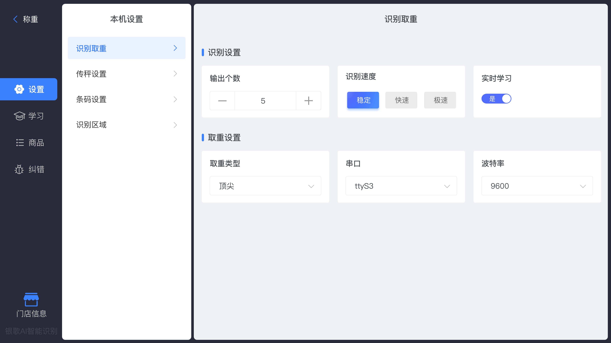
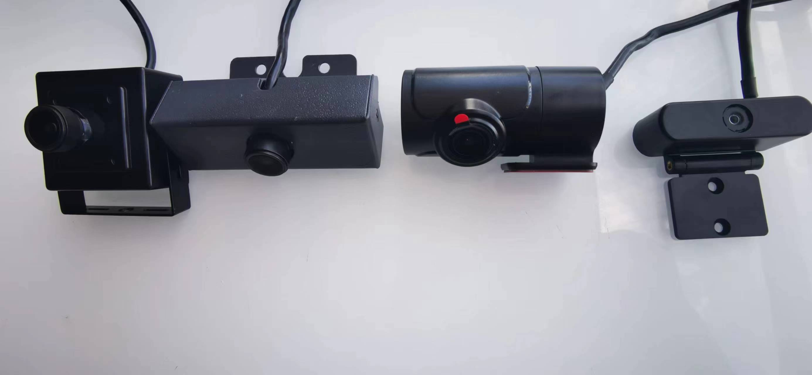

	

	<strong>银歌AI智能识别系统 -计算机视觉与人工智能技术，深度学习AI算法，赋能产业全新的智能化变革</strong>

	👉 <a href="https://www.yingeo.com">https://www.yingeo.com</a> 👈

-------------------------------------------------------------------------------

## 银歌AI智能识别系统（AI称重方案）

#### 项目介绍
若干年来，在商场、超市、菜市场等场景，“收银不称重、称重不收银”的现象延续至今。随着科技的发展，称重收银一体化已成为现实，消费者获取到更为便捷的购物体验。深圳市银歌云技术有限公司推出首款AI识别电子秤解决方案，实现了称重、商品AI识别、打印、收银、支付功能等一体化管理。

#### 传统称重的痛点
传统电子秤还需专业人士才能操作，需要熟记大量的商品编码，例如: 1001(苹果)、1002(橘子)，商家要认真培训才可以理解操作流程，达到熟练使用至少需要一月以上。

#### 银歌AI称重的优点
无需熟记大量的商品编码，放入商品自动识别，就算0基本也可立即使用。

银歌云技术独创的实时自我学习算法，

商品学习（银歌AI识别系统可对商品进行实时学习，学习过程仅需1秒即可完成）

打开实时学习（系统会记住每一次的识别结果，并不断学习，到达越用越聪明，越用越好用。）

### AI前端硬件识别摄像头模组

### 集成方案

硬件客户: 深圳市银歌云技术提供标准的算法，模型，以及完整的边缘端部署方案。

软件客户: 提供标准的SDK，API接口，Flutter跨平台等方案。

零码接入银歌AI智能识别系统，助力产业界软硬件能力提升，推动和赋能智能化变革。

### 产品团队

产品经理：王成云，刘勤，万华勇

算法及模型训练：王成云，王炜锋

服务端架构：郭辉

边端计算及架构：王炜锋，王成云

***
微信扫描下方二维码，关注官方公众号：银歌收银，获取更多精彩内容。

